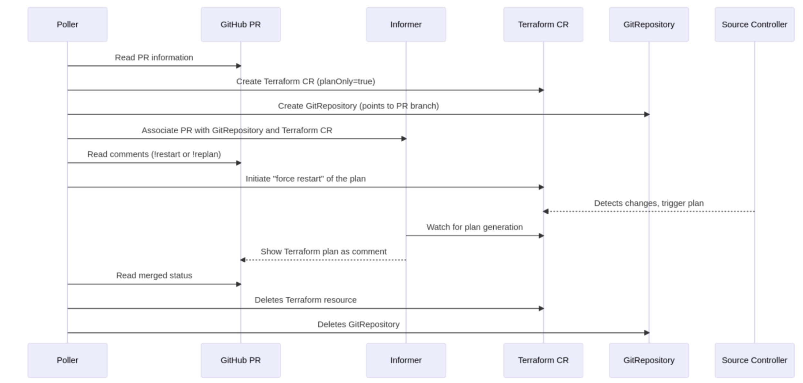

# Branch Planner Overview

The GitOps methodology streamlines infrastructure provisioning and management, using Git as the source of truth. The Branch Planner, a component of Tofu-Controller, aims to take this a step further by allowing developers and operations teams to plan Terraform configurations on a branch that's separate from the `main` branch. This makes it easier to review and understand the potential impact of your changes before you run `terraform apply`.

The Branch Planner's most important feature is its seamless integration with the PR (Pull Request) user interface. When enabled through Helm values, it watches repositories that contain Terraform resources at regular intervals—checking their referenced Source, and polling for Pull Requests using GitHub's API and the provided token. When changes are proposed on a new branch, Branch Planner runs a plan in the cluster and displays the results directly as comments on your PR. Once you're satisfied with the results, you can merge your branch into the `main` branch to trigger the Tofu-Controller to reconcile the updated code.

### Replan commands

The Branch Planner also allows users to manually trigger the replan process. By simply commenting `!replan` under the PR, the Branch Planner will be instructed to generate a new plan and post it under the PR as a new comment.

Now that you know what Branch Planner can do for you, follow the [guide to get started](./branch-planner-getting-started.md).

